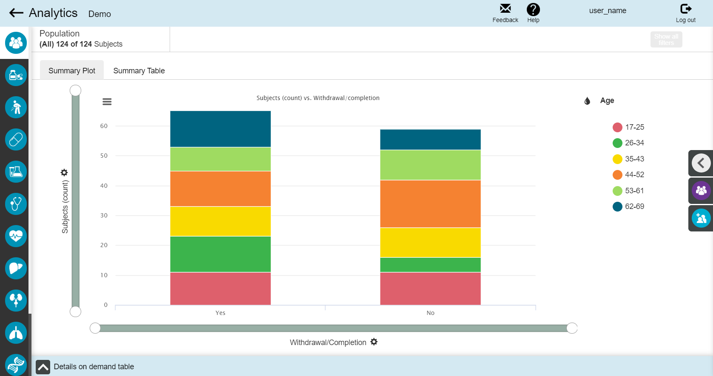

[](https://github.com/digital-ECMT/vahub/actions/workflows/publish-war-artifact.yml)

**ACUITY**  

ACUITY is a digital solution to revolutionize the way we can interpret and analyze data from clinical trials. 
It will facilitate data interpretation through an interactive visual platform designed to effortlessly enable access across a drug program and individual studies, down to individual patient level data.  

System includes several applications:  
* VA-Hub - a web application showing the clinical trials data visualizations
* <a href='https://github.com/digital-ECMT/acuity-admin'>AdminUI</a> - a web application to load clinical studies data into the ACUITY
* <a href='https://github.com/digital-ECMT/va-security'>VA-Security</a> – a web application providing authentication/authorization settings for the system

Check <a href='https://github.com/digital-ECMT/acuity-docker/wiki'>ACUITY Visualisations Wiki</a> for more information.

#Table of Contents  

## VA-Hub Installation

  

These instructions will help you run a copy of the VA-Hub project on your local machine for development and testing purposes.  
For local development run backend and frontend applications separately. See [Deployment instructions](TODO: add link) to deploy the project on a live system.

### Prerequisites

* Java SE Development Kit >=1.8
* Maven 3.5.4
* Node.js 6.10.1
* npm 3.10.10

### Running backend
1. [Set up database](https://github.com/digital-ECMT/acuity-docker/wiki/Applications-Setup) to be used in ACUITY applications.(prefer [deployments scripts](https://github.com/digital-ECMT/acuity-deployment-scripts) for that purposes)  
    If you've already done this during installation of other ACUITY applications, skip this step.

2. Set up database connection settings in a Spring profile file `application-<envSpecificProfile>.yml` located in `/local-configs` directory (See [ACUITY Database Setup#Configuring Spring Profiles](https://github.com/va-hub/wiki/Database-Setup#configuring-spring-profiles)).

3. <a href='https://github.com/digital-ECMT/va-security'>Install all VA-Security artifacts</a> to the local repository.  
    (if you've already done this during installation of other ACUITY applications, skip this step)

4. In a command-line tool run Maven `clean` and `install` tasks from the application root directory:

    ```
    mvn clean install
    ```

5. VA-Hub backend can be run in two modes:
    * perform authentication/authorization checks configured in VA-Security application
    * skip VA-Security checks and provide full permissions to the user  

    When running backend with VA-Security checks, user can see drug programmes/studies/datasets and perform actions only if he/she was explicitly authorized for it in VA-Security application. This mode can be useful when application integration with VA-Security component matters.  

    Without VA-Security checks user can see all drug programmes/studies/datasets available in the system and can perform any operation on them. This mode can be convenient when developing and testing features not related to VA-Security.  

    To start backend process with VA-Security checks and Spring configs from remote configuration server run from `/vahub` directory:
    ```
    mvn spring-boot:run -Dspring.profiles.active=<envSpecificProfile>,local-auth,remote-config,NoScheduledJobs -Dmaven.test.skip=true -Dspring.cloud.config.uri=http://config-server:8888/acuity-spring-configs -Dserver.port=8000
    ```

    To start backend process without VA-Security checks and with local Spring config files run from `/vahub` directory:
    ```
    mvn spring-boot:run -Dspring.profiles.active=<envSpecificProfile>,local-no-security,local-config,NoScheduledJobs -Dspring.config.location=./../local-configs/ -Dmaven.test.skip=true -Dserver.port=8000
    ```

    where 
    * `<envSpecificProfile>` is a name of Spring profile for specific environment (`dev`, `test`) located in `/local-configs` directory
    * `http://config-server:8888/acuity-spring-configs` - URL of running Spring Cloud configuration server
    
6. You may also run VA-Hub in containerized mode (you need to have Docker and Docker Compose installed for it). It's simpler, but before that you have to build the project (this includes Docker image building):
```shell script
mvn clean package -P webapp 
```
The running command itself should be run from `/vahub/docker-resources` directory and looks like:
```shell script
docker-compose --env-file .env.<targetEnv> up
``` 
where `<targetEnv>` may be `test` or `dev` depending on which environment database you want to run. This allows to run VA-Hub without VA-Security; to run it with VA-Security, please read the common instruction in `acuity-docker` project `README.md` file.

7. When you'll see a big ASCII-art text "VAHUB HAS STARTED" in the console, VA-Hub backend app is ready to accept requests at http://localhost:8080/resources. You may check that the app works by accessing Swagger page at http://localhost:8000/swagger-ui.html.

### Running frontend

**Installing**   

From `/vahub/src/main/webapp` run following commands one by one:

```
npm cache clean
```

```
npm install
```

```
npm run ag-grid-enterprise -- off
```

**Running**  

From `/vahub/src/main/webapp` run:
```
npm start
```
This command will launch VA-Hub front end application at http://localhost:3000/.

**Running tests**  

From `/vahub/src/main/webapp` run:
```
npm test
```

**Deployment**  

From `/vahub/src/main/webapp` run the following command to make sure production bundle can be built:
```
npm run build
```

## Usage
Check <a href='https://github.com/digital-ECMT/acuity-docker/wiki/VAHub-Testing'>ACUITY Visualisations Wiki</a> for user manuals.

## Contributing
See [Contributing Guide](/docs/contributing.md).

## License
Licensed under the [Apache 2.0](http://www.apache.org/licenses/LICENSE-2.0) license.
